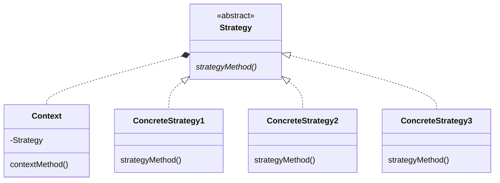

# Strategy Pattern

アルゴリズム（戦略・作戦・方策）をサッと切り替え、同じ問題を別の方法で解くことを容易にするパターン

## Role

| Role               | Description                                                         |
| ------------------ | ------------------------------------------------------------------- |
| `Strategy`         | 戦略を利用するためのインタフェースを定める                          |
| `ConcreteStrategy` | 具体的な戦略（作戦、方策、方法 → アルゴリズム）を実装する           |
| `Context`          | `Strategy` を利用する                                               |
|                    | `ConcreteStrategy` のインスタンスを持ち、必要に応じてそれを利用する |
|                    | `ConcreteStrategy` のフィールドやメソッド等を必要に応じて呼び出す   |

## Sample Code

### Java

- じゃんけんをするプログラムで、その`戦略`を切り替える部分に Strategy Pattern を使う
  - 戦略 ①：勝ったら次も同じ手を出す
  - 戦略 ②：一回前の手から次の手を確率的に計算する

| Class name      | Description                                              |
| --------------- | -------------------------------------------------------- |
| Hand            | じゃんけんの「手」を表すクラス                           |
| Strategy        | `Strategy`                                               |
|                 | じゃんけんの「戦略」を表すインタフェース                 |
| WinningStrategy | `ConcreteStrategy`                                       |
|                 | 買ったら次も同じ手を出す戦略を表すクラス                 |
| ProbStrategy    | `ConcreteStrategy`                                       |
|                 | 一回前の手から次の手を確率的に計算する戦略を表すクラス   |
| Player          | `Context`                                                |
|                 | じゃんけんを行うプレイヤーを表すクラス                   |
| Main            | Taro と Hana に 10000 回じゃんけんさせる                 |
|                 | Taro が WinningStrategy、Hana が ProbStrategy を使用する |

### Dart

- 配列のソートを目的としたプログラム
  - ソートアルゴリズムを Strategy Pattern で実装する例

## Usage/Tips/Pros and Cons

- アルゴリズムの切り替え（アルゴリズムの新規追加や変更）が容易

  - 容易に切り替えられるのでアルゴリズム間のパフォーマンス比較が容易
  - 実行中に切り替えることもでき、これも有用な場合がある
    - システムリソースが多い場合と少ない場合で使用する戦略を切り替えたり〜
    - 高速だがバグがあるかもしれないアルゴリズムの検算を、低速だが正確なアルゴリズムに行わせたり〜

## Related Patterns

- [Flyweight Pattern](../20-flyweight-pattern/)
  - ConcreteStrategy は、Flyweight Pattern を使って複数箇所から共有させられるよう設計する場合がある
- [Abstract Factory Pattern](../08-abstract-factory-pattern/)
  - Strategy Pattern ではアルゴリズムを切り替えれる
  - 対して Abstract Factory Pattern は、具体的な工場、部品、製品を切り替えれる
- [State Pattern](../19-state-pattern/)
  - Strategy Pattern も State Pattern も、どちらも**委譲先を切り替えるパターン**であり、クラス間の関係も類似している
  - 両パターンは目的が異なる
    - Strategy Pattern は、`アルゴリズム`を表現する ConcreteStrategy クラスを作成し、切り替えることが**できる**
    - State Pattern は、`状態`を表現する ConcreteState クラスを作成し、状態げ変化するたびに委譲先のクラスを**必ず**切り替える
