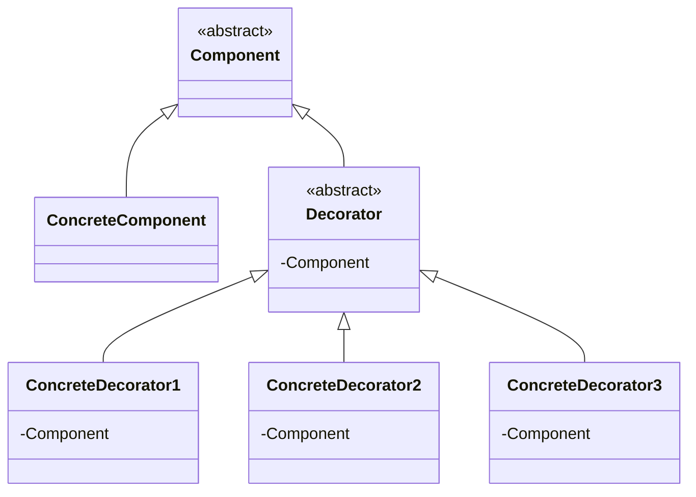
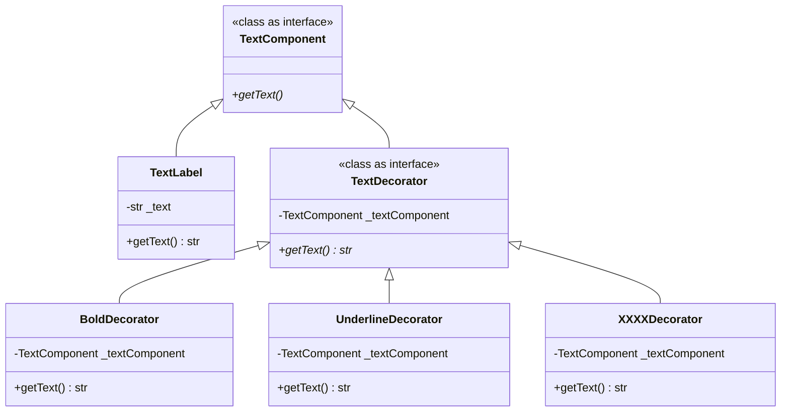

# Decorator Pattern

- ざっくりと：オブジェクトにどんどんデコレーションを施していくパターン
- 厳密には：透過的なインタフェースを保ったまま、オブジェクトを次々に被せて機能追加していくパターン
  - 中心にあるスポンジケーキに対し
    - クリームを塗るとショートケーキへ
    - イチゴを載せるとストロベリーショートケーキへ
    - 板チョコを乗せて名前を書き、キャンドルを立てればバースデーケーキへ
    - ...

## Role

| Role                | Description                                                  |
| ------------------- | ------------------------------------------------------------ |
| `Component`         | 装飾される側のインタフェース(スポンジケーキ)                 |
| `ConcreteComponent` | 装飾される側の実装(具体的なスポンジケーキ)                   |
| `Decorator`         | 装飾する側のインタフェース(デコレーションの材料)             |
|                     | 装飾される側のインタフェースを持ち、装飾される側自体も持つ   |
| `ConcreteDecorator` | 具体的なデコレーション材料(クリーム、板イチゴ、板チョコなど) |



## Sample Code

### Java

- 内容：文字列 xxx の周りに飾り枠をつけて表示する

```
+-----+
| xxx |
+-----+
```

| Class name    | Description                              |
| ------------- | ---------------------------------------- |
| Display       | `Component`                              |
|               | 文字列表示用の抽象クラス                 |
| StringDisplay | `ConcreteComponent`                      |
|               | 一行だけからなる文字列表示用の具体クラス |
| Border        | `Decorator`                              |
|               | 飾り枠を表す抽象クラス                   |
| SideBorder    | `ConcreteDecorator`                      |
|               | 左右にのみ飾りつける                     |
| FullBorder    | `ConcreteDecorator`                      |
|               | 上下左右に飾りつける                     |
| Main          | ...                                      |

### Python

- 文字列を飾る〜
  - baseLabel: `Hello, World!`
  - boldLabel: `<b>Hello, World!</b>`
  - underlineLabel: `<u>Hello, World!</u>`
  - boldUnderlineLabel: `<b><u>Hello, World!</u></b>`



## Usage/Tips

- 透過的なインタフェース
  - 透過的：意識しなくても使える
  - 飾り枠（サブクラス）で中身（スーパークラス）を包んでも、インタフェースは隠されることなくたクラスから見れる → これをインタフェースが透過的という
- 中身を変えずに機能追加ができる
  - 包まれるものを変更することなく、機能の追加ができる
- 動的な機能追加ができる
  - 委譲（インスタンスの DI）でクラス間を結合しているので、Client 側のソース変更だけで別オブジェクトを生成できる
- 単純な品揃えでも、多様な機能追加ができる
  - ConcreteDecorator をたくさん用意しておくことで、それらを自由に組み合わせたオブジェクトを生成できる

## Related Patterns

- [Adapter Pattern](../02-adapter-pattern/)
  - Adapter はズレのある二つのインタフェースをつなぐ
  - Decorator は中身のインタフェースを変えずに外枠を作る（透過的）
- [Strategy Pattern](../10-strategy-pattern/)
  - Strategy はアルゴリズムを切り替えて機能実現する
  - Decorator は外枠を取り替えたり、外枠を重ねたりして機能を追加する
- [Composite Pattern](../11-composite-pattern/)
  - Composite は機能を追加するところでなく、容器と中身を同一視するところに主眼がある
  - Decorator は機能を柔軟に追加するために再帰的な構造を利用する
