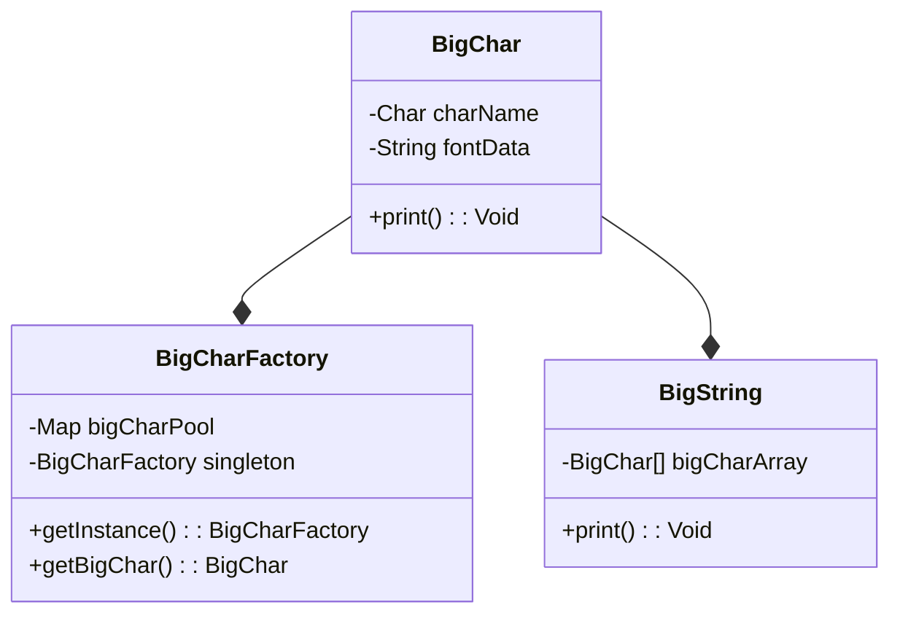
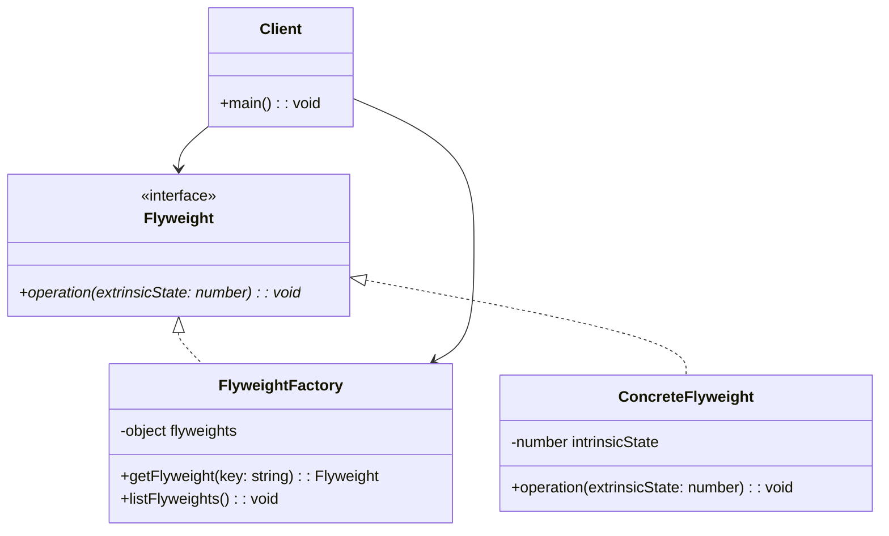

# Flyweight Pattern

- メモリの消費を抑え、オブジェクトを軽くするパターン
  - インスタンスをできるだけ共有し、無駄に new しない

## Role

| Role             | Description                                                    |
| ---------------- | -------------------------------------------------------------- |
| Flyweight        | 共有されるオブジェクトのクラス                                 |
| FlyweightFactory | Flyweight を作成・管理するもの                                 |
| Client           | FlyweightFactory を使って Flyweight を作り、それを利用するもの |

## Sample Code

### Java

| Class name     | Description                                            |
| -------------- | ------------------------------------------------------ |
| BigChar        | 「大きな文字」                                         |
| BigCharFactory | BigChar のインスタンスを共有しながら生成するクラス     |
|                | インスタンス既に作成されているかを確認してから生成する |
| BigString      | BigChar を集めて作った「大きな文字列」                 |
| Main           | ...                                                    |

### xxx

## Tips / Pros and Cons

- Tips
  - インスタンスを共有する → 共有するものを変更すると、**複数箇所に影響が及ぶ**
    - 意図的な影響ならよいが、無意識に変更されていることに注意するべき
  - 共有する情報（`intrinsic`な情報）
    - 場所や状況に依存しない情報で、共有できる
  - 共有しない情報（`extrinsic`な情報）
    - 場所や状況に依存する情報で、共有できない
  - `HashMap`に入れられたインスタンスは、ガーベッジコレクションの対象外となることに注意
    - 使われてないけど残り続ける → メモリ圧迫、という事態を避けよう
- Pros
  - メモリ使用量を削減できる
  - パフォーマンスの向上: Flyweight Pattern を使用することで、オブジェクトの数が減り、処理速度が向上する場合がある
  - 柔軟性が高い: Flyweight Pattern は、外部状態と内部状態を分離することで、柔軟性が高い設計が可能になる
  - 再利用性が高い: Flyweight オブジェクトを再利用することができるため、コードの再利用性が高まる
- Cons
  - 内部状態と外部状態の区別が難しい
  - オブジェクトの変更が難しい: Flyweight オブジェクトは共有されているため、一部のオブジェクトの変更がすべてのオブジェクトに影響する可能性がある

## Related Patterns

- [Proxy Pattern](../21-proxy-pattern/)
  - 代理人を建てることで処理スピードを上げるパターン
  - Flyweight はインスタンス共有によって処理スピードを上げるパターン
- [Composite Pattern](../11-composite-pattern/)
  - Flyweight Pattern を使って、Composite の Leaf 役を共有できる場合がある
- [Singleton Pattern](../05-singleton-pattern/)
  - FlyweightFactory が Singleton で実装されることが多い
  - Singleton インスタンスは intrinsic な情報しか持たない
