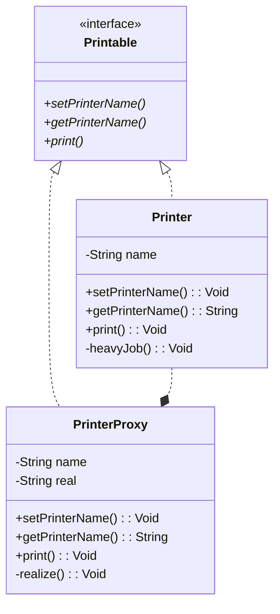
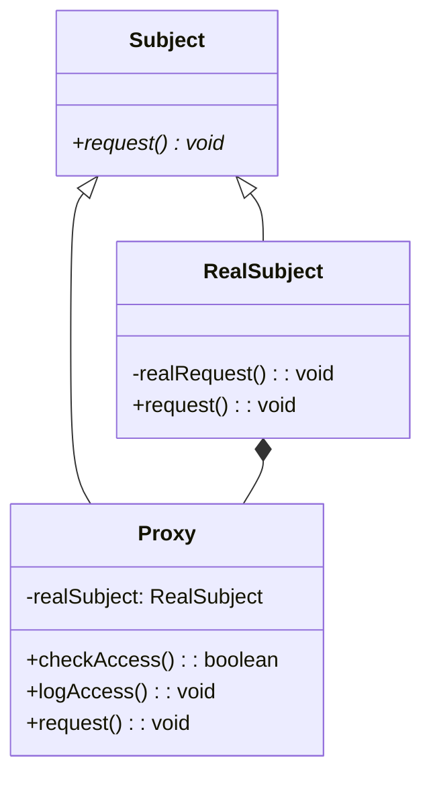

# Proxy Pattern

- 必要になってから作る
- Proxy: 代理人

## Role

| Role        | Description                                             |
| ----------- | ------------------------------------------------------- |
| Subject     | Proxy と RealSubject を同一視するためのインタフェース   |
| Proxy       | Client の要求に応える                                   |
|             | 応えられない場合に RealSubject を呼び出し、処理を任せる |
| RealSubject | Proxy では手に負えなくなった時に登場する「本人」        |

## Sample Code

### Java

- 名前付きのプリンタ
  - 実際にプリントを行う段階になって初めて、PrinterProxy クラスは Printer クラスのインスタンスを生成する
  - Printer クラスは PrinterProxy のことを**知らない**

| Class name   | Description                              |
| ------------ | ---------------------------------------- |
| Printer      | 名前付きのプリンタを表すクラス（本人）   |
| Printable    | 共通インタフェース                       |
| PrinterProxy | 名前付きのプリンタを表すクラス（代理人） |
| Main         | ...                                      |

### TypeScript

## Tips / Pros and Cons

- Tips
  - Proxy はそれ自体を使う・使わない取捨選択できる（部品として良い。独立性ある。）
    - ex. Main では、PrinterProxy を使わず Printer を直接呼んでも良い
      - → PrintProxy は`透過的`である
  - 様々な Proxy
    - HTTP Proxy
    - Virtual Proxy
      - 本章で紹介した、本当にインスタンスが必要になった時点で生成初期化を行うやつ
    - Remote Proxy
      - RealSubject がネットワークの向こう側にいるにもかかわらず、あたかも自分のそばにいるかのように（透過的に）メソッド呼び出しができるもの
      - Java の RMI が相当
    - Access Proxy
      - RealSubject の機能に対してアクセス制限を設けるもの
- Pros
  - アクセス制御: Proxy は、Real Subject にアクセスする前に、アクセス制御を実行できるため、リソースの保護や不正アクセスの防止が可能
  - リモートアクセス: Proxy は、RealSubject がリモートで実行されている場合でも、クライアントがそのオブジェクトにアクセスできるようにする
  - オブジェクトの生成の遅延: Proxy は、RealSubject が必要な場合にだけ作成されるため、システムの負荷を低減する
  - キャッシュ: Proxy は、RealSubject が生成されるたびに同じリクエストを実行しなくても、リクエストをキャッシュすることができる
    - 処理時間やネットワークのトラフィックを節約できる
  - 実装の隠蔽: Proxy は、RealSubject の実装を隠蔽することができ、RealSubject の変更による影響を最小限に抑える
- Cons
  - パフォーマンスの低下: Proxy によって追加される追加のレイヤーは、パフォーマンスに影響を与える可能性がある
  - デバッグの困難さ: Proxy が RealSubject に複数のリクエストを送信する場合、それぞれのリクエストに対して Proxy と RealSubject の間のやり取りを追跡する必要があるため、デバッグがより困難になる場合がある
  - 複雑性の増加: Proxy が RealSubject に複数のリクエストを送信する場合、Proxy 自体が複雑になり、メンテナンスが困難になる場合がある
  - セキュリティ上のリスク: Proxy は、RealSubject に渡されるリクエストを検証しない場合、Proxy 自体がセキュリティ上のリスクになる場合がある
  - 実装の複雑さ: Proxy は、Real Subject のインタフェースを実装する必要があるため、実装の複雑さが増す場合がある

## Related Patterns

- [Adapter Pattern](../02-adapter-pattern/)
  - インタフェースが異なるオブジュエクト間を埋める働きをする
  - 一方 Proxy は、インタフェースが透過的である
- [Decorator Pattern](../12-decorator-pattern/)
  - 透過的なインタフェースを用いる点で似ている
  - Decorator の目的は、新しい機能を追加すること
  - Proxy の目的は、本人の作業を肩代わりして本人へのアクセスを軽減すること
