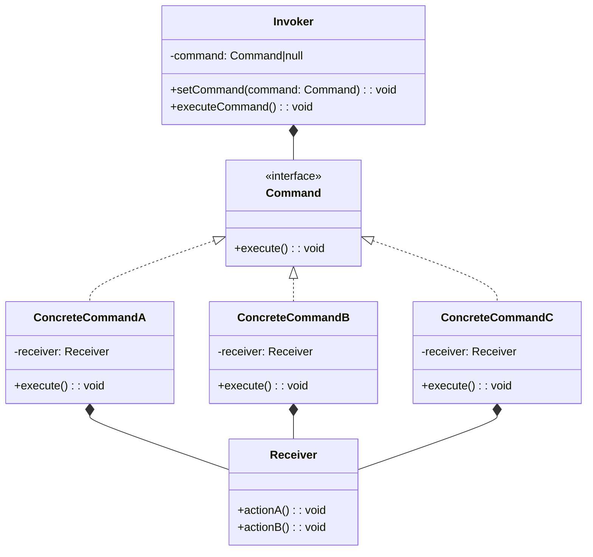

# Command Pattern

`命令`をオブジェクトとして表現し、履歴を取ったり再実行を行ったりできるパターン

## Role

| Role            | Description                                                |
| --------------- | ---------------------------------------------------------- |
| Command         | 命令のインタフェース                                       |
| ConcreteCommand | 具体的な命令                                               |
| Receiver        | Command 役が命令を実行するときに対象となる役               |
| Client          | ConcreteCommand を作り、その際に Receiver 役を割り当てる役 |
| Invoker         | 命令の実行を開始する役                                     |

## Sample Code

### Java

| Package | Class name   | Description                              |
| ------- | ------------ | ---------------------------------------- |
| command | Command      | `Command`                                |
|         |              | 命令を表現するインタフェース             |
| command | MacroCommand | `ConcreteCommand`                        |
|         |              | 複数の命令をまとめた命令を表現するクラス |
| drawer  | DrawCommand  | `ConcreteCommand`                        |
|         |              | 点の描画命令を表現するクラス             |
| drawer  | Drawable     | 描画対象を表現するインタフェース         |
| drawer  | DrawCanvas   | `Receiver`                               |
|         |              | 描画対象を実装したクラス                 |
|         | Main         | `Client`兼`Invoker`                      |

### TypeScript

## Tips / Pros and Cons

- 命令が持つべき情報は？と考える必要がある
  - 今回は、ConcreteCommand が Receiver を`知っている`ことにより、ConcreteCommand を誰が管理していても`execute()`が実行できる
- Pros
  - 分離とカプセル化: コマンドを表すオブジェクトと実際の処理を行うオブジェクトを分離し、カプセル化することができる
  - 拡張性: 新しいコマンドを追加する際に、既存のコードを変更せずに独立して実装することができる
  - Undo/Redo の実装: コマンドが実行された履歴を保持することで、アプリケーションの Undo/Redo 機能を簡単に実装できる
  - 遅延実行: コマンドオブジェクトを作成して後で実行することができるため、遅延実行やスケジューリングが可能
  - マクロコマンドの作成: 複数のコマンドをまとめて一つのマクロコマンドとして実行できる
- Cons
  - クラス数の増加: コマンドごとに具体的なコマンドクラスが必要である
  - 過剰な抽象化: シンプルな処理の場合、逆にコードがわかりにくくなることがある
  - パフォーマンスへの影響: 間接的な呼び出しが含まれるため、パフォーマンスに影響を与える可能性がある
  - 学習コスト: Command パターンの適切な理解と実装には学習コストが必要である
  - 適用範囲の制限: オブジェクト指向プログラミングに適用されるため、関数型プログラミングなどでは利点が得られない場合がある

## Related Patterns

- [Composite Pattern](../11-composite-pattern/)
  - マクロコマンドを実現するために使われることがある
- [Memento Pattern](../18-memento-pattern/)
  - Command の履歴を保存する場合に使われる場合がある
- [Prototype Pattern](../06-prototype-pattern/)
  - 発生したイベントを複製(clone)したい場合に使われる場合がある
