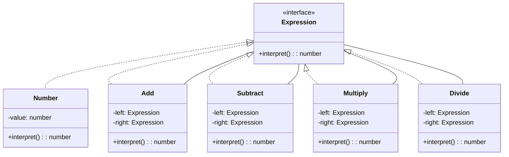

# Interpreter Pattern

- 文法規則をクラスで表現する
  - 構文解析や評価のような言語処理のためのデザインパターン
- デザインパターンの目的の一つ：クラスの再利用性を高めること

## Role

|     |     |     |
| --- | --- | --- |
|     |     |     |
|     |     |     |

## Sample Code

### Java

- ミニ言語を定義し、その構文解析を行うプログラム
  - お題は「車を動かす」
- BNF

```
<program> ::= program <command list>
<command list> ::= <command>* end
<command> ::= <repeat command> | <primitive command>
<repeat command> ::= repeat <number> <command list>
<primitive command> ::= go | right | left
```

| Class name           | Description                          |
| -------------------- | ------------------------------------ |
| Node                 | 構文木のノードになるクラス           |
| ProgramNode          | <program>                            |
| CommandListNode      | <command list>                       |
| CommandNode          | <command>                            |
| RepeatCommandNode    | <repeat command>                     |
| PrimitiveCommandNode | <primitive command>                  |
| Context              | 構文解析のための前後関係を表すクラス |
| ParseException       | 構文解析中の例外クラス               |
| Main                 | ...                                  |

### xxx



-

## Usage/Tips/Pros and Cons

- wip
  - wip
- Pros
  - wip
- Cons
  - wip

## Related Patterns

- [x Pattern]()
  - wip
- [x Pattern]()
  - wip
- [x Pattern]()
  - wip
