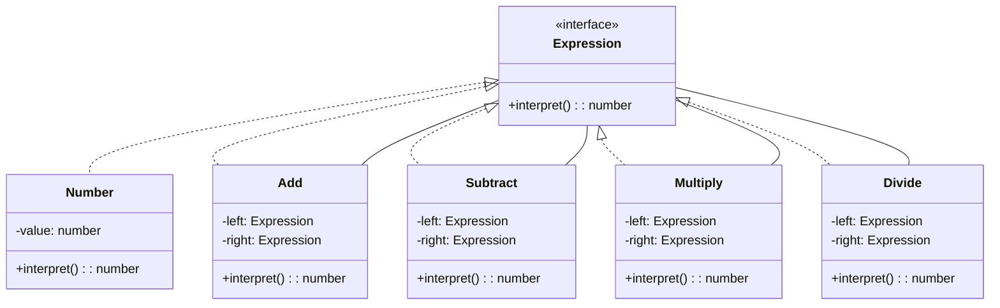

# Interpreter Pattern

- 文法規則をクラスで表現する
  - 構文解析や評価のような言語処理のためのデザインパターン
- デザインパターンの目的の一つ：クラスの再利用性を高めること

## Role

| Role                  | Description                                                                      |
| --------------------- | -------------------------------------------------------------------------------- |
| AbstractExpression    | 構文木のノードに共通のインタフェースを定める                                     |
| TerminalExpression    | BNF の終端を表す                                                                 |
| NonTerminalExpression | BNF の非終端を表す                                                               |
| Context               | インタプリタが構文解析を行うための情報を提供する役                               |
| Client                | 構文木を組み立てるために、TerminalExpression, NonTerminalExpression を呼び出す役 |

## Sample Code

### Java

- ミニ言語を定義し、その構文解析を行うプログラム
  - お題は「車を動かす」
- BNF

```
<program> ::= program <command list>
<command list> ::= <command>* end
<command> ::= <repeat command> | <primitive command>
<repeat command> ::= repeat <number> <command list>
<primitive command> ::= go | right | left
```

| Class name           | Description                          |
| -------------------- | ------------------------------------ |
| Node                 | 構文木のノードになるクラス           |
| ProgramNode          | <program>                            |
| CommandListNode      | <command list>                       |
| CommandNode          | <command>                            |
| RepeatCommandNode    | <repeat command>                     |
| PrimitiveCommandNode | <primitive command>                  |
| Context              | 構文解析のための前後関係を表すクラス |
| ParseException       | 構文解析中の例外クラス               |
| Main                 | ...                                  |

### TypeScript

- 四則演算を行うプログラム



## Tips / Pros and Cons

- 様々なミニ言語
  - 正規表現
  - 検索構文
    - ex. Web 検索エンジンの検索オプション: `site:example.com "word1" AND "word2"`
  - バッチ処理言語
    - ex. Bash, .bat, cron などなど
- Pros
  - 拡張性: 新しい文法規則や表現を追加しやすい
  - 再利用性: 各構成要素（終端式や非終端式）が独立しているため、再利用しやすい
  - 分離: 構文解析と評価が分離され、各コンポーネントが独立しているため、可読性とメンテナンス性が向上する
- Cons
  - 効率: 構文木の生成や解析にはコストがかかり、実行速度が低下することがある
  - 複雑性: 文法が複雑になると、構文木やクラス構造も複雑になりがち
  - 限定的な適用範囲: 主に簡単な文法や言語処理に適用され、大規模で複雑な文法には不向き

## Related Patterns

- [Composite Pattern](../11-composite-pattern/)
  - NonTerminalExpression 役は再起的な構造を持つことが多いので、Composite Pattern で表現されることが多い
- [Flyweight Pattern](../20-flyweight-pattern/)
  - TerminalExpression 役は、Flyweight Pattern を使って共有される場合もある
- [Visitor Pattern](../13-visitor-pattern/)
  - 構文木を作ったあと、構文木の各ノードを巡回しながら処理を行う場合に Visitor Pattern が使われる場合がある
