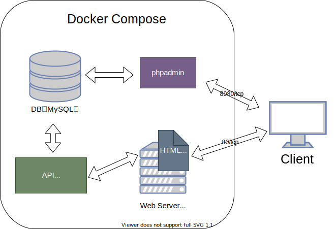

### Overview
Webサービスを運営する想定で、Dockerコンテナ群を用意してみる。

サービスのシステム構成は下記の図のようになっている。

### How to activate this project
* `docker-compose build`
* `docker-compose up`
* Webアプリケーション: `http://localhost/`
* DB管理者画面: `http://localhost:8080/`
